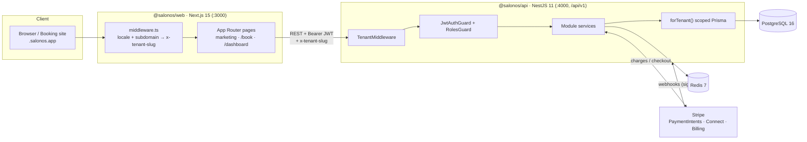

# Architecture

## 1. System overview

SalonOS is a pnpm + Turborepo monorepo with two deployable apps and one shared package. The browser talks to a NestJS REST API; the API owns all business logic and is the only thing that touches PostgreSQL, Redis and Stripe.



Plain-text view:

```
Browser ──HTTP──> Next.js (web) ──REST /api/v1 + JWT + x-tenant-slug──> NestJS (api)
                                                                          │
                                          ┌───────────────┬───────────────┼───────────────┐
                                          ▼               ▼               ▼               ▼
                                     PostgreSQL        Redis           Stripe        (SMTP/Twilio/S3
                                   (Prisma, scoped)   (cache/q)   (pay/connect/billing)   optional)
```

---

## 2. Monorepo layout

| Workspace | Package | Responsibility |
| --- | --- | --- |
| `apps/api` | `@salonos/api` | REST API, auth, tenancy, business logic, Stripe, Swagger |
| `apps/web` | `@salonos/web` | Marketing site, booking flow, owner/staff dashboard, i18n |
| `packages/database` | `@salonos/database` | Prisma schema, generated client, `forTenant()` isolation, seed |

Turborepo (`turbo.json`) wires task dependencies: `build` depends on upstream `^build`, so `@salonos/database` is generated/compiled before the apps. `dev` is persistent and uncached. `.env` is a global dependency so changes bust the cache.

---

## 3. Request lifecycle (tenant-scoped route)

A typical authenticated dashboard request — e.g. `GET /api/v1/bookings` — flows through:

1. **Web middleware** (`apps/web/src/middleware.ts`) runs next-intl locale routing and, on a tenant subdomain, sets the `x-tenant-slug` header. The API client (`lib/api.ts`) also injects `x-tenant-slug` (defaulting to `lumiere` in the demo) and the `Authorization: Bearer <jwt>` header.

2. **TenantMiddleware** (`apps/api/src/tenant/tenant.middleware.ts`) runs for every route. It resolves a slug (header → subdomain → query), looks up the `Tenant`, and attaches `req.tenant` + `req.tenantId`. Unknown slug → 404; no slug → request continues (auth/webhook routes don't need a tenant).

3. **JwtAuthGuard** (global) validates the access token via the Passport JWT strategy, unless the route is `@Public()`. The decoded user (`sub`, `tenantId`, `role`, …) is attached to `req.user`.

4. **RolesGuard** (global) enforces `@Roles(...)` metadata when present (e.g. `OWNER, MANAGER` for write operations). No metadata → allowed for any authenticated user.

5. **Controller** pulls the tenant id with `@CurrentTenant()` (throws `400` if none was resolved) and delegates to a **service**.

6. **Service** does all data access through `TenantService.getClient(tenantId)` → `forTenant(tenantId)`, a Prisma `$extends` client that **auto-filters and auto-stamps `tenantId`** on every tenant-owned model. This is defence-in-depth: even a forgotten `where` clause can't leak another salon's rows. Cross-tenant/platform data (Tenant lookup, RefreshToken, WebhookEvent, Subscription) uses the raw `PrismaService.client`.

7. **Response** — errors are normalised by the global `AllExceptionsFilter`; money is handled with `Decimal` helpers in `common/money.ts`.

Public booking-site requests (`/api/v1/public/*`) skip auth (`@Public()`) but still resolve the tenant from `x-tenant-slug`/subdomain, so a guest can browse and book.

---

## 4. Folder responsibilities (API)

```
apps/api/src/
├── main.ts            # bootstrap: raw body for Stripe, helmet, CORS, global
│                      #   ValidationPipe, /api/v1 prefix, Swagger at /docs
├── app.module.ts      # module wiring + global guards/filter + TenantMiddleware
├── auth/              # AuthService (register/login/refresh/logout/me),
│                      #   JWT strategy, JwtAuthGuard, RolesGuard, @Public/@Roles
├── tenant/            # TenantMiddleware + @CurrentTenant() decorator
├── database/          # PrismaService (raw singleton) + TenantService (scoped)
├── stripe/            # StripeService (SDK wrapper, webhook verify, price map)
├── messaging/         # MailService + NotificationService
├── common/            # AllExceptionsFilter, money.ts, shared request types, DTOs
└── modules/           # one folder per domain (controller + service + dto):
                       #   tenants, locations, staff, services, clients, bookings,
                       #   products, sales, payments, billing, reports, reviews,
                       #   public, webhooks
```

## 5. Folder responsibilities (Web)

```
apps/web/src/
├── app/[locale]/      # locale-prefixed routes:
│                      #   /            marketing landing
│                      #   /login /signup
│                      #   /book        multi-step public booking
│                      #   /dashboard   overview + calendar/clients/services/
│                      #                staff/pos/reports/settings
├── components/        # marketing, dashboard, booking, auth, ui (shadcn/ui)
├── i18n/              # locale config (en/ur/ar, RTL), next-intl routing
├── messages/          # en.json · ur.json · ar.json
├── lib/               # api client, mock fallback data, stripe, types, utils
├── hooks/             # TanStack Query hooks (use-salon-data) with mock fallback
└── middleware.ts      # locale routing + subdomain → x-tenant-slug
```

---

## 6. Key decisions

**Why NestJS for the API.** Opinionated, modular structure (modules/controllers/services/guards/pipes), first-class DI, decorators for cross-cutting concerns (auth, roles, validation), and built-in Swagger generation. This keeps a feature-rich domain (booking, POS, billing) organised and testable.

**Why Prisma + PostgreSQL.** A relational salon domain (clients, appointments, sales, payments, inventory) maps naturally to SQL with strong constraints and indexes. Prisma gives a type-safe client shared across the API and seed, painless migrations, and — crucially — a `$extends` query layer that powers tenant isolation. Postgres adds JSON columns (notification payloads, audit meta), arrays (client tags), and `Decimal` money.

**Why shared-database multi-tenancy.** A single shared schema with row-level `tenantId` is the simplest to operate at this stage: one migration, one connection pool, trivial cross-tenant platform queries, and low per-tenant overhead. Isolation is enforced both at the app layer (guards) and the data layer (`forTenant()`), with a clear upgrade path to schema-per-tenant or Postgres RLS later. See [MULTI-TENANCY.md](MULTI-TENANCY.md).

**Why Next.js App Router.** Server components + per-locale routing (`/[locale]/...`) make i18n and RTL clean, marketing pages fast and SEO-friendly, and the dashboard a rich client app. next-intl handles translations and locale-prefixed navigation; middleware doubles as the subdomain → tenant resolver. TanStack Query manages server state with a graceful mock-data fallback so the UI always renders.

**Stripe split: payments vs. billing.** Client payments (salon revenue) and SaaS subscriptions (platform revenue) are deliberately separate flows. Connect destination charges route money to each salon; Checkout/Portal/webhooks run the platform's own subscription billing. Webhooks are signature-verified and idempotent (`WebhookEvent` table) so retries are safe.
