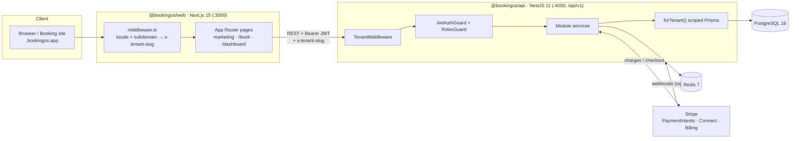

# Architecture

## 1. System overview

BookingOS is a pnpm + Turborepo monorepo with two deployable apps and one shared package. The browser talks to a NestJS REST API; the API owns all business logic and is the only thing that touches PostgreSQL, Redis and Stripe.



Plain-text view:

```
Browser ──HTTP──> Next.js (web) ──REST /api/v1 + JWT + x-tenant-slug──> NestJS (api)
                                                                          │
                                          ┌───────────────┬───────────────┼───────────────┐
                                          ▼               ▼               ▼               ▼
                                     PostgreSQL        Redis           Stripe        (SMTP/Twilio/S3
                                   (Prisma, scoped)   (cache/q)   (pay/connect/billing)   optional)
```

---

## 2. Monorepo layout

| Workspace | Package | Responsibility |
| --- | --- | --- |
| `apps/api` | `@bookingos/api` | REST API, auth, tenancy, business logic, Stripe, Swagger |
| `apps/web` | `@bookingos/web` | Marketing site, booking flow, owner/staff dashboard, i18n |
| `packages/database` | `@bookingos/database` | Prisma schema, generated client, `forTenant()` isolation, seed |

Turborepo (`turbo.json`) wires task dependencies: `build` depends on upstream `^build`, so `@bookingos/database` is generated/compiled before the apps. `dev` is persistent and uncached. `.env` is a global dependency so changes bust the cache.

---

## 3. Request lifecycle (tenant-scoped route)

A typical authenticated dashboard request — e.g. `GET /api/v1/bookings` — flows through:

1. **Web middleware** (`apps/web/src/middleware.ts`) runs next-intl locale routing and, on a tenant subdomain, sets the `x-tenant-slug` header. The API client (`lib/api.ts`) also injects `x-tenant-slug` (defaulting to `lumiere` in the demo) and the `Authorization: Bearer <jwt>` header.

2. **TenantMiddleware** (`apps/api/src/tenant/tenant.middleware.ts`) runs for every route. It resolves a slug (header → subdomain → query), looks up the `Tenant`, and attaches `req.tenant` + `req.tenantId`. Unknown slug → 404; no slug → request continues (auth/webhook routes don't need a tenant).

3. **JwtAuthGuard** (global) validates the access token via the Passport JWT strategy, unless the route is `@Public()`. The decoded user (`sub`, `tenantId`, `role`, …) is attached to `req.user`.

4. **TenantContextGuard** (global, right after auth) re-binds `req.tenant`/`req.tenantId` to the tenant in the user's **JWT** for authenticated requests — the client-supplied `x-tenant-slug` is *not* trusted to pick the tenant once a user is authenticated (a tenant user can only ever act within their own tenant; `SUPER_ADMIN` with `tenantId === null` is exempt). Public routes keep the header/subdomain-resolved tenant.

5. **RolesGuard** (global) enforces `@Roles(...)` metadata when present (e.g. `OWNER, MANAGER` for write operations). No metadata → allowed for any authenticated user.

6. **Controller** pulls the tenant id with `@CurrentTenant()` (throws `400` if none was resolved) and delegates to a **service**.

7. **Service** does all data access through `TenantService.getClient(tenantId)` → `forTenant(tenantId)`, a Prisma `$extends` client that **auto-filters and auto-stamps `tenantId`** on every tenant-owned model. This is defence-in-depth: even a forgotten `where` clause can't leak another tenant's rows. Cross-tenant/platform data (Tenant lookup, RefreshToken, WebhookEvent, Subscription) uses the raw `PrismaService.client`.

8. **Response** — errors are normalised by the global `AllExceptionsFilter`; money is handled with `Decimal` helpers in `common/money.ts`.

Public booking-site requests (`/api/v1/public/*`) skip auth (`@Public()`) but still resolve the tenant from `x-tenant-slug`/subdomain, so a guest can browse and book.

---

## 4. Verticals & term-packs

BookingOS is **multi-vertical**: one schema and one booking engine serve many industries. Specialisation happens at two layers, both purely additive — the core data model never forks.

- **`Tenant.vertical`** (`Vertical` enum: `SALON | CLINIC | FITNESS | HOTEL | RENTAL | RESTAURANT | EVENTS | SERVICES | GENERAL`) is chosen at signup. It drives UI terminology and the default booking mode for new offerings.
- **Term-packs** (`apps/web/src/lib/verticals.ts`) map the canonical concepts — *resource · offering · category · customer · booking · book-verb* — to industry words. The same `Service` row is labelled "Treatment" for a clinic, "Room Type" for a hotel, "Class" for a gym. The same `StaffProfile` row is a "Practitioner", "Room" or "Table".
- The web app resolves the active tenant's pack with **`useTerms()`** (`apps/web/src/hooks/use-terms.ts`), so dashboard navigation and screens relabel automatically. Anything without a pack value falls back to GENERAL / the next-intl translations.

Because relabelling is presentational, the API, Prisma models and analytics are vertical-agnostic — a new industry is mostly a new term-pack plus sensible booking-mode defaults.

## 5. Booking-mode strategy (three availability engines)

A booking is not one-size-fits-all. Each offering carries a **`bookingMode`** (`BookingMode` enum) that selects how availability is computed and how a booking consumes capacity. All three engines live in `apps/api/src/modules/bookings/availability.service.ts`; `BookingsService.create()` dispatches **per line item** on `service.bookingMode`.

| Mode | Question it answers | Inputs | Engine method | Consumes |
| --- | --- | --- | --- | --- |
| **TIME_SLOT** | "Which start times are free for this provider on this day?" | working hours, time-off, existing booked items, duration + buffers, tenant timezone | `getSlots()` / `isStaffFree()` | a provider's time |
| **DATE_RANGE** | "Are there units free for `[checkIn, checkOut)`?" | `Service.inventory`, overlapping booked items | `checkDateRange()` | `quantity` units of finite inventory |
| **CAPACITY** | "How many seats are left for this fixed-time session?" | `Service.capacity`, items at that `start` | `checkCapacity()` | `quantity` seats at a session |

**TIME_SLOT** is the historical salon path: it walks each eligible resource's working-hour windows, subtracts time-off and existing `AppointmentItem`s, and emits per-start slots (timezone-correct via `Intl.DateTimeFormat`, so "9 AM" always means 9 AM in the tenant's city).

**DATE_RANGE** treats an offering as a pool of `inventory` identical units (hotel rooms of a type, rental vehicles). It counts the `quantity` of overlapping non-cancelled bookings and reports `unitsLeft`. Price is `service.price × nights × quantity`.

**CAPACITY** treats an offering as a session with a fixed `capacity` of seats (a class, an event, restaurant covers). It sums `quantity` across items sharing the same session `start` and reports `seatsLeft`. Price is `service.price × quantity`.

Booking creation validates against the right engine, then persists `AppointmentItem.quantity` and (for CAPACITY) `Appointment.partySize`. `StaffProfile.resourceType` (`HUMAN | ROOM | TABLE | EQUIPMENT | UNIT`) and its optional `capacity` let non-human resources (rooms, tables) participate in the same model.

> **Surface note:** both the authenticated dashboard (`/bookings/availability`, `/bookings/availability/date-range`, `/bookings/availability/capacity`) and the public booking site (`/public/availability`, `/public/availability/date-range`, `/public/availability/capacity`) expose all three engines; `POST /public/bookings` accepts `endsAt` + `quantity`. The web reserve-flow UI (`apps/web/src/components/booking/reserve-page.tsx`, route `/[locale]/[slug]/reserve`) renders a mode-specific picker for each: TIME_SLOT slot grid, DATE_RANGE check-in/check-out + units, CAPACITY date/time + seats.

## 6. Folder responsibilities (API)

```
apps/api/src/
├── main.ts            # bootstrap: raw body for Stripe, helmet, CORS, global
│                      #   ValidationPipe, /api/v1 prefix, Swagger at /docs
├── app.module.ts      # module wiring + global guards/filter + TenantMiddleware
├── auth/              # AuthService (register/login/refresh/logout/me),
│                      #   JWT strategy, JwtAuthGuard, RolesGuard, @Public/@Roles
├── tenant/            # TenantMiddleware + @CurrentTenant() decorator
├── database/          # PrismaService (raw singleton) + TenantService (scoped)
├── stripe/            # StripeService (SDK wrapper, webhook verify, price map)
├── messaging/         # MailService + NotificationService
├── common/            # AllExceptionsFilter, money.ts, shared request types, DTOs
└── modules/           # one folder per domain (controller + service + dto):
                       #   tenants, locations, staff, services, clients, bookings,
                       #   products, sales, payments, billing, reports, reviews,
                       #   public, webhooks
```

## 7. Folder responsibilities (Web)

```
apps/web/src/
├── app/[locale]/      # locale-prefixed routes:
│                      #   /            marketing landing
│                      #   /login /signup
│                      #   /book        multi-step public booking
│                      #   /dashboard   overview + calendar/clients/services/
│                      #                staff/pos/reports/settings
├── components/        # marketing, dashboard, booking, auth, ui (shadcn/ui)
├── i18n/              # locale config (en/ur/ar, RTL), next-intl routing
├── messages/          # en.json · ur.json · ar.json
├── lib/               # api client, mock fallback data, stripe, plans,
│                      #   verticals (term-packs), types, utils
├── hooks/             # TanStack Query hooks (use-salon-data) with mock fallback
└── middleware.ts      # locale routing + subdomain → x-tenant-slug
```

---

## 8. Key decisions

**Why NestJS for the API.** Opinionated, modular structure (modules/controllers/services/guards/pipes), first-class DI, decorators for cross-cutting concerns (auth, roles, validation), and built-in Swagger generation. This keeps a feature-rich domain (booking, POS, billing) organised and testable.

**Why one schema across verticals + booking modes.** Rather than fork the data model per industry, BookingOS keeps a single relational domain (customers, bookings, offerings, resources, sales, payments, inventory) and specialises only at the edges: `Tenant.vertical` + term-packs for language, and `Service.bookingMode` for behaviour. This means one migration set, one API surface and one analytics layer serve salons, hotels and event organisers alike — and a new industry is a term-pack plus booking-mode defaults, not a new codebase.

**Why Prisma + PostgreSQL.** The relational booking domain maps naturally to SQL with strong constraints and indexes. Prisma gives a type-safe client shared across the API and seed, painless migrations, and — crucially — a `$extends` query layer that powers tenant isolation. Postgres adds JSON columns (notification payloads, audit meta), arrays (customer tags), and `Decimal` money.

**Why shared-database multi-tenancy.** A single shared schema with row-level `tenantId` is the simplest to operate at this stage: one migration, one connection pool, trivial cross-tenant platform queries, and low per-tenant overhead. Isolation is enforced both at the app layer (guards) and the data layer (`forTenant()`), with a clear upgrade path to schema-per-tenant or Postgres RLS later. See [MULTI-TENANCY.md](MULTI-TENANCY.md).

**Why Next.js App Router.** Server components + per-locale routing (`/[locale]/...`) make i18n and RTL clean, marketing pages fast and SEO-friendly, and the dashboard a rich client app. next-intl handles translations and locale-prefixed navigation; middleware doubles as the subdomain → tenant resolver. TanStack Query manages server state with a graceful mock-data fallback so the UI always renders.

**Stripe split: payments vs. billing.** Customer payments (tenant revenue) and SaaS subscriptions (platform revenue) are deliberately separate flows. Connect destination charges route money to each tenant; Checkout/Portal/webhooks run the platform's own subscription billing. Webhooks are signature-verified and idempotent (`WebhookEvent` table) so retries are safe.
